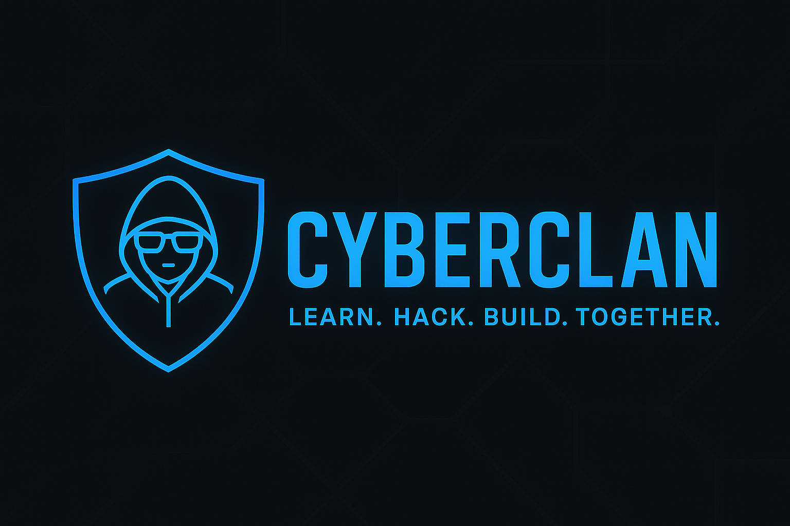

  

<h1 align="center">🛡️ CYBERCLAN – Future-Driven Cybersecurity Collective ⚔️</h1>

  <em>Learn. Hack. Build. Together.</em>

---

## 👥 Who We Are

CyberClan is a collective of cybersecurity students united by a common goal:  
**launching a future-focused startup in cyber defense**.  

We combine **technical mastery**, **team collaboration**, and **real-world challenge solving** to stand out in the cybersecurity ecosystem.

## 🎯 Our Mission

- 🚀 **Master key cybersecurity fields**: Reverse, Pwn, Web, Crypto, Forensics, Red Teaming...
- 🧠 **Sharpen our skills** through weekly labs, CTFs, and research.
- 🛠️ **Build tools and scripts** to automate and enhance security tasks.
- 💼 **Lay the groundwork** for a professional cybersecurity company.

## 📂 What You’ll Find Here

- ✍️ **Writeups** – Documented solutions to CTF challenges
- 🛠️ **Tools** – Scripts, payload generators, automation tools
- 📚 **Guides & Notes** – Our personal learning material, shared to help others
- 🚧 **Projects** – Ongoing work on security tools & proof-of-concepts

## 🗺️ Roadmap

We’re in an intensive 24-week preparation phase toward a major **CTF event in December**:

- 🧩 Weekly themes: OSINT, Crypto, Reverse, Pwn, Web, Forensics…
- 🕹️ Internal mini-CTFs & labs
- ⚙️ Tool development & scripting
- 🧪 Final simulation & team strategy

## 🤝 Collaborate With Us

We welcome collaborations, feedback, and discussions. If you're into ethical hacking, security engineering, or building cool tools — **let's connect**!

- 📬 `cyberclan.contact [@] proton.me`
- 🌐 Website / LinkedIn coming soon

---

<strong>⚡ CyberClan – Learn, Hack, Build. Together. ⚡</strong>

